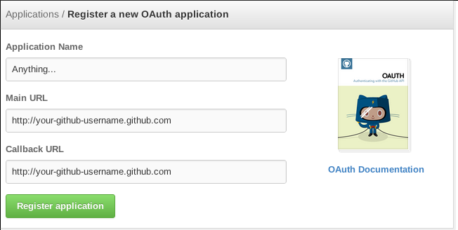

petal
======

Github issues powered comments. Inspired by [sirbrad/comcom](https://github.com/sirbrad/comcom)

Live Demo
---------

http://hit9.github.io/petal/


How to use
----------

First, new an issue for petal use, and then copy the codes below to your webpage.

(rewrite the `"user/rep"` and `issue_id` to yours)

```html
<!-- jquery 1.7+ required -->
<script type="text/javascript" src="http://ajax.googleapis.com/ajax/libs/jquery/1.7.2/jquery.min.js"></script>
<!-- petal begin -->
<link rel="stylesheet" href="http://hit9.org/petal/css/petal.min.css" type="text/css" />
<script src="http://hit9.org/petal/build/petal.min.js" type="text/javascript" charset="utf-8"></script>
<script>
    $(document).ready(function(){  // important!
        $.petal.init("user/repo", issue_id) // $.petal.init(repo, issue_id)
    })
</script>
<div class="petal"></div>
<!-- petal end -->
```

For github pages users
----------------------

You need to  [register an application on github](https://github.com/settings/applications/new), and write your domain `username.github.com` in the field `Main URL` and `Callback URL`.



**This is for cross-domain-usage.**

FAQ & Common issues
-------------------

1. Make sure that your webpage's domain is allowed to cross domain

2. Have you changed the `"user/repo"` and `issue_id` to yours?

3. Already new an issue?

4. petal works with jQuery.

Developers
----------

### Front end

1. fork this repo

2. install dependences(coffee, sass and node-minify, java runtime):

  ```
  npm install -g coffee-script
  npm install node-minify
  gem install sass
  ```

3. And then update submodule

  ```
  git submodule --init update
  ```

4. Use make to compile

### Back end

Where the proxy script(which post to github for access_token) is ?

    http://petal.ap01.aws.af.cm

And the py script:

```python
from flask  import Flask, redirect, request, url_for
import requests
import urllib
import urlparse

application = app = Flask(__name__)

@app.route("/")
def index():
    code = request.args.get("code")
    callback = request.args.get("callback", "http://hit9.org/petal")

    client_id = "2ae54488ab61bc732407"
    client_secret = "xxxxxxxxxxxxxxxxxxxxxxxxxxxx"

    data = {
        "code": code,
        "client_id": client_id,
        "client_secret": client_secret
    }
    headers = {'Accept': 'application/json'}
    token_url = "https://github.com/login/oauth/access_token"
    re = requests.post(token_url, data=data, headers=headers)
    token = re.json()['access_token']

    # update callback with parameter:petaltoken
    params = {"petaltoken": token}
    url_parts = list(urlparse.urlparse(callback))
    query = dict(urlparse.parse_qsl(url_parts[4]))
    query.update(params)
    url_parts[4] = urllib.urlencode(query)
    redirect_url = urlparse.urlunparse(url_parts)

    return redirect(redirect_url)

if __name__ == '__main__':
    app.run(debug=True)
```
